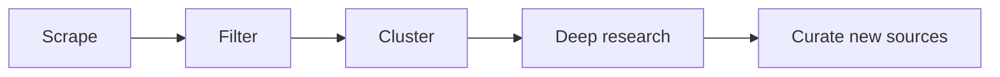

# Awesome AI Sources

The AI frontier, distilled.

[Visit Agentic Brew](https://www.agenticbrew.ai) | [Browse the full source directory](SOURCES.md)

## 1. What This Is

This repository publishes the sources behind [Agentic Brew](https://www.agenticbrew.ai): high-signal places to follow if you care about AI, frontier labs, agents, infrastructure, research, startups, and builder workflows. See [SOURCES.md](SOURCES.md) for the full source directory.

The list is free to browse and use. [Agentic Brew](https://www.agenticbrew.ai) is the product built on top of it, with context, visuals, community signals, and historical background added to the important AI stories.

Current inventory:
- 209 public sources
- 49 company & lab sources
- 31 individual blogs
- 44 AI news & analysis sites
- 2 research feeds & paper trackers
- 83 social accounts and communities

This repository is updated weekly.

## 2. Source Directory

The directory is split by source type so it is easy to scan:

- Company & lab sources: official publications from AI companies, labs, platforms, and research groups
- Individual blogs: independent writers, technical newsletters, and practitioner publications
- AI news & analysis sites: media outlets, newsletters, and aggregators covering AI
- Research feeds & paper trackers: research aggregators and paper-discovery feeds
- Social accounts to follow: selected X accounts, YouTube channels, and Reddit communities

See the full live-generated list here: [SOURCES.md](SOURCES.md).

## 3. Why Agentic Brew

Following good sources is necessary, but it is not enough. AI moves across Product Hunt, GitHub, Reddit, X, YouTube, newsletters, tech blogs, AlphaXiv, Hugging Face, Luma, company blogs, research feeds, event pages etc... Agentic Brew helps you keep up without jumping between all of them.

What the product adds:

- From 200+ sources, Agentic Brew identifies high-attention AI topics and explains why they matter, not just what happened.
- AI news, blogs, research, launches, community reactions, videos, and events are brought together in one website.
- The source directory keeps improving. New candidates are discovered as the site runs, then reviewed by a human each week before they are added here.

The goal is to avoid missing high-quality sources while keeping the reading experience focused.

## 4. How It Works

The workflow is simple:

If you want the raw source list, start with [SOURCES.md](SOURCES.md). If you want the product built from it, use [Agentic Brew](https://www.agenticbrew.ai).

## 5. Keep This Directory Fresh

This directory is refreshed weekly as the source map evolves.

If you use it as a starting point, check back occasionally for newly added sources and better organization.

## 6. Use The Product

Visit [agenticbrew.ai](https://www.agenticbrew.ai) to use Agentic Brew.

Browse [SOURCES.md](SOURCES.md) when you want the source directory itself.
