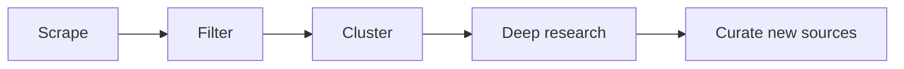

# Awesome AI Sources

The AI frontier, distilled.

[Visit Agentic Brew](https://www.agenticbrew.ai) | [Browse the full source directory](SOURCES.md)

## 1. What This Is

This repository publishes the sources behind [Agentic Brew](https://www.agenticbrew.ai): high-signal places to follow if you care about AI, frontier labs, agents, infrastructure, research, startups, and builder workflows. See [SOURCES.md](SOURCES.md) for the full source directory.

The list is free to browse and use. [Agentic Brew](https://www.agenticbrew.ai) is the product built on top of it, with context, visuals, community signals, and historical background added to the important AI stories.

Current inventory:
- 233 public sources
- 62 company & lab sources
- 36 individual blogs
- 44 AI news & analysis sites
- 2 research feeds & paper trackers
- 89 social accounts and communities

This repository is updated weekly.

## 2. Source Directory

The directory is split by source type so it is easy to scan:

- Company & lab sources: official publications from AI companies, labs, platforms, and research groups
- Individual blogs: independent writers, technical newsletters, and practitioner publications
- AI news & analysis sites: media outlets, newsletters, and aggregators covering AI
- Research feeds & paper trackers: research aggregators and paper-discovery feeds
- Social accounts to follow: selected X accounts, YouTube channels, and Reddit communities

See the full live-generated list here: [SOURCES.md](SOURCES.md).

## 3. Why Agentic Brew


Following good sources is necessary, but it is not enough. AI moves across Product Hunt, GitHub, Reddit, X, YouTube, newsletters, tech blogs, AlphaXiv, Hugging Face, Luma, company blogs, research feeds, event pages etc... Agentic Brew helps you keep up without jumping between all of them.

What the product adds:

- From 200+ sources, Agentic Brew identifies high-attention AI topics and explains why they matter, not just what happened.
- AI news, blogs, research, launches, community reactions, videos, and events are brought together in one website.
- The source directory keeps improving. New candidates are discovered as the site runs, then reviewed by a human each week before they are added here.

The goal is to avoid missing high-quality sources while keeping the reading experience focused.

## 4. How It Works

The workflow is simple:



If you want the raw source list, start with [SOURCES.md](SOURCES.md). If you want the product built from it, use [Agentic Brew](https://www.agenticbrew.ai).

## 5. Keep This Directory Fresh

This directory is refreshed weekly as the source map evolves.

If you use it as a starting point, check back occasionally for newly added sources and better organization.

## 6. Use From Any AI Agent

Agentic Brew exposes the curated source content as public RSS feeds, so any AI coding agent (Claude Code, OpenClaw, Cursor, custom agents, etc.) can pull from it without scraping or auth.

### The feeds

Eleven public endpoints under `https://www.agenticbrew.ai/feed/<feed>.xml`:

| Feed           | Contents | Item link points to |
|----------------|----------|---------------------|
| `news`         | Synthesized news clusters with overviews | Agentic Brew news-analysis card |
| `twitter`      | Trending X topics with the hottest tweets and engagement stats | Top tweet on x.com |
| `github`       | Trending GitHub AI repos with stars / language / daily delta | Original GitHub repo |
| `reddit`       | Trending Reddit AI threads with subreddit, upvotes, comments, excerpt | Original Reddit thread |
| `youtube`      | Curated AI videos with summaries | Original YouTube video |
| `product_hunt` | Trending AI launches with topics and taglines | Original Product Hunt launch |
| `skill`        | Top skills from skills.sh and clawhub | Original skill page |
| `blog`         | Curated AI blog articles with AI-generated summaries | Original blog article |
| `paper`        | Research papers with AI summary, institutions, source, votes | Original paper (arxiv / HF / x.com) |
| `event`        | Upcoming AI events with start time and summaries | Original event page (e.g., lu.ma) |
| `all`          | Union of all of the above | Per-item — same as the feed above |

### Option A: any agent — call the feeds directly

Any agent that can run a shell command, fetch a URL, or read RSS can use the feeds with no installation. For example, in a bash-capable agent:

```bash
curl -s https://www.agenticbrew.ai/feed/news.xml
```

Point your agent at this list of feed URLs as a tool, or have it fetch the desired feed on demand. Each feed is standard RSS 2.0; any XML/RSS parser works.

### Option B: Claude Code — one-line plugin install

For Claude Code users, a ready-made plugin wraps the feeds as a slash command:

```bash
claude plugin install github:sunxiayi/awesome-ai-sources/plugins/agentic-brew
```

Then in any Claude Code session:

```
/agentic-brew [feed] [--limit N] [--query KEYWORD] [--json]
```

Examples:

```
/agentic-brew news
/agentic-brew paper --limit 5
/agentic-brew twitter --query "openai"
/agentic-brew all --json
```

### Option C: other agent frameworks — reuse the skill definition

The plugin's skill definition (a single markdown file with frontmatter and a small bash + Python parsing snippet) lives at [`plugins/agentic-brew/skills/agentic-brew/SKILL.md`](plugins/agentic-brew/skills/agentic-brew/SKILL.md). If your agent framework supports skill / instruction files (OpenClaw, custom harnesses, etc.), point it at that file or copy the snippet into your own tool format. The skill is self-contained — no external dependencies beyond Python's stdlib.

## 7. Use The Product

Visit [agenticbrew.ai](https://www.agenticbrew.ai) to use Agentic Brew.

Browse [SOURCES.md](SOURCES.md) when you want the source directory itself.
